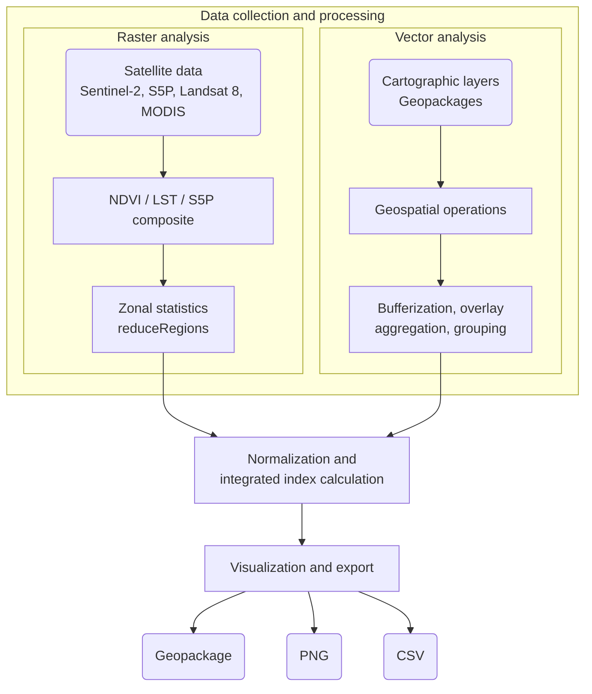
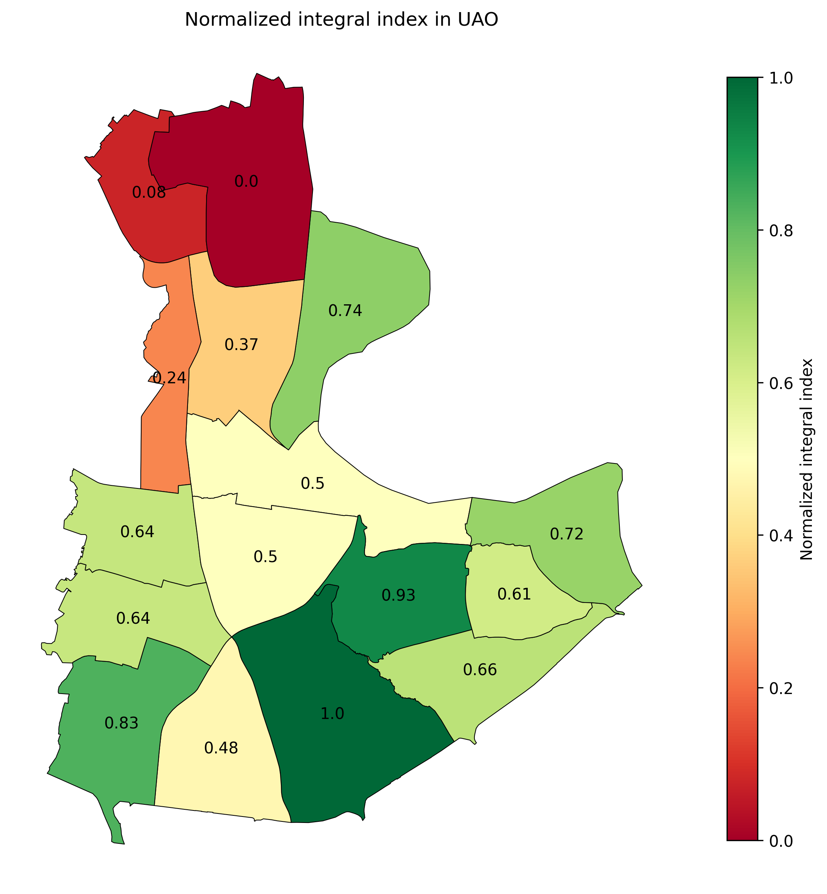

# __Comprehensive GIS-assessment of urban area (on the example of the Southern Administrative Okrug in Moscow)__

### This is a pet-project developed as a practical implementation of the methodology from my Bachelor's thesis in Environmental Science. The main goal was to move away from routine manual work in QGIS and build a reproducible Python-based workflow.


## Methodology
### The environmental index is calculated as the arithmethic mean of five selected environmental factors (criteria):
- `green_area` - fraction of vegetation cover (Sentinel-2)
- `air_pollution` - air pollution subindex based on the average of five air components: NO2, SO2, CO, O3, AOD (Sentinel-5P, MODIS)
- `lst` - land surface temperature (combined from LANDSAT-8 and MODIS)
- `build_density` - built-up area per district
- `road_density` - total length of roads per district


## Workflow



## Results
#### Example of ranking maps:
<div style="display: flex; justify-content: center; gap: 20px;">
  
  
</div>

## Repository structure
- `data/`
- `results/`
    - `figures/`
    - `geopackages/`
    - `tables/`
- `modules/`
    - `criteria.py`
    - `gee_auth.py`
    - `load_data.py`
- `.env`
- `config.py`
- `main.py`
- `preprocessing.py`

## How to run
### 1. Install dependencies:

```python
pip install -r requirements.txt
```

### 2. Prepare data

__Vectors__

| Data   | Format | Description |
| ------ | ------ | ----------- |
| districts | .gpkg  | Administrative units at the city or county scale |
| buildings  | .gpkg  | Buildings polygons |
| roads | .gpkg | Linear highway objects |
|        |        |             |

Put the obtained data into the `data/` folder
</br>

_You can obtain these layers from OpenStreetMap using QGIS (OSM plugin) or via the OSMnx library._

__Rasters__

Rasters area exported once to GEE Assets via the [preprocessing.py](preprocessing.py):
```bash
python preprocessing.py
```

### 3. Configure the .env file

 - Copy and rename [.env.example](.env.example) file to .env

```bash
cp .env.example .env
```

- Enter your crendentials and assets' directories

```python
PROJECT_ID=your-cloud-project-ID
GEE_AUTH_MODE=localhost
# ...
```
### 4. Run pipeline
```bash
python main.py
```

## Notes

- The index is **comparative**, not absolute. Designed for ranking districts within a city and don't respond to environmental standards.
- Accuracy depends on satellite data quality and vector layer completeness.
- Currently optimized for urban districts.