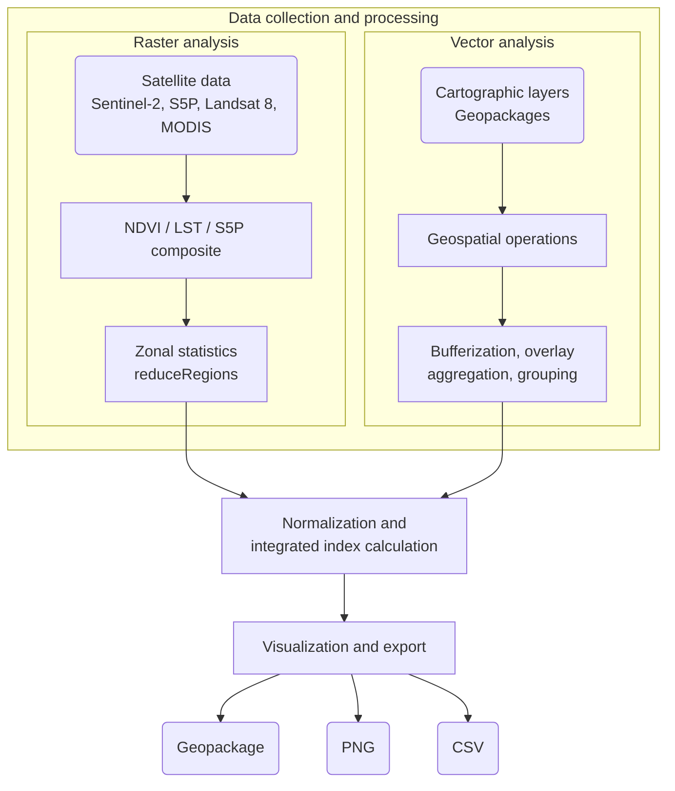
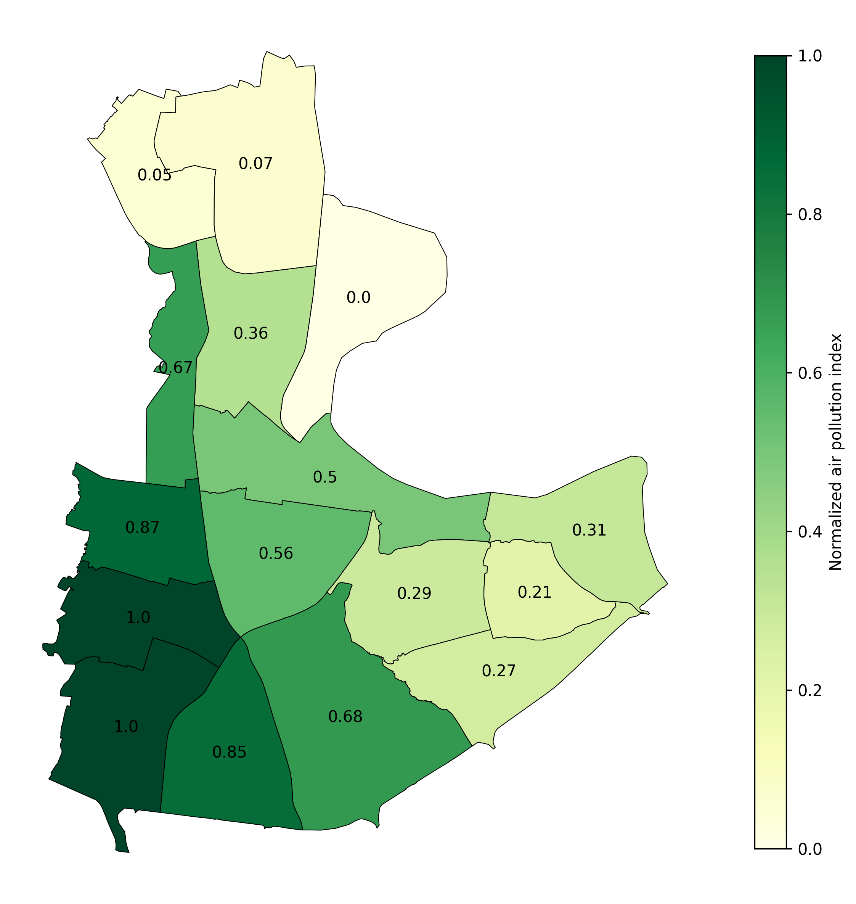
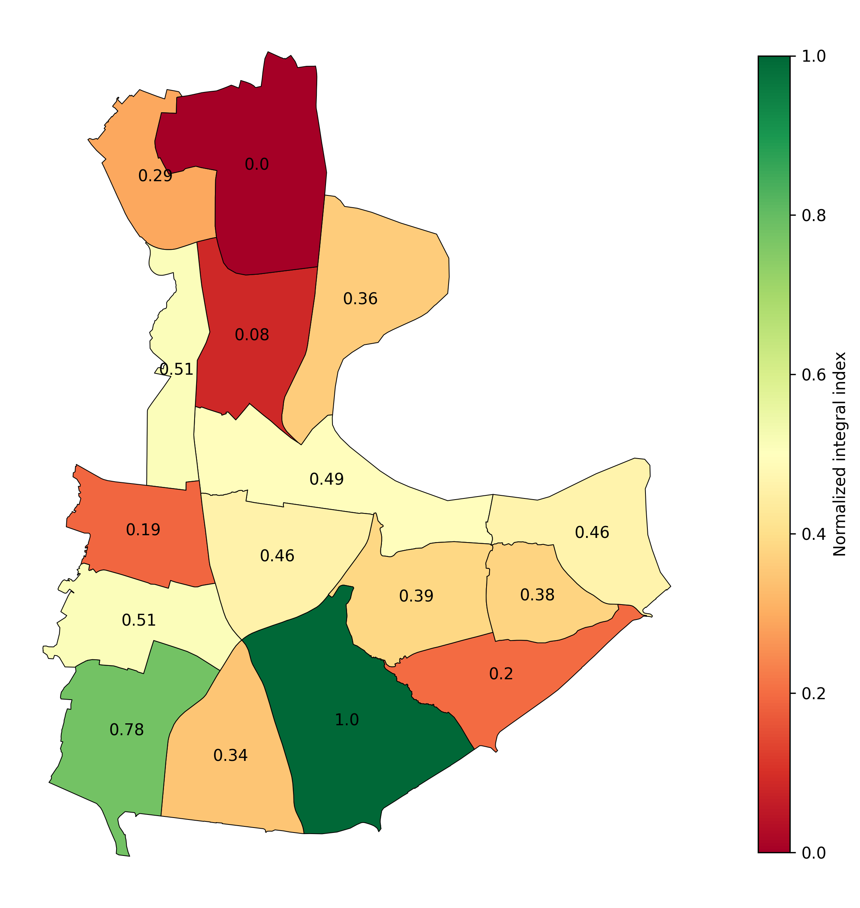

# __Comprehensive GIS-assessment of urban area (on the example of the Southern Administrative Okrug in Moscow)__

## Overview

### Automation of integrated environmental index calculaion. The script automates satellite and cartographic data processing. This is a pet-project that was developed from the methodology of my bachelor's thesis in Environmental Science (RUDN, 2026). It is aimed to replace routine manual processing in QGIS and to design the scalable and reproducible python-based workflow. 

## Methodology
### The environmental index is calculated as arithmethic mean of five selected environmental factors (criteria):
- `green_area` - area of vegetation cover
- `air_pollution` - air pollution subindex based on five air components: NO2, SO2, CO, O3, AOD
- `lst` - land surface temperature
- `build_density` - built-up area
- `roads_density` - road network buffer area


## Project structure



## Results
#### Example of ranking maps: air pollution index and normalized integral index
<div style="display: flex; justify-content: center; gap: 20px;">
  
  
</div>

## Repository structure
- `assets/`
- `results/`
    - `figures/`
    - `geopackages/`
    - `tables/`
- `src/`
    - `criteria.py`
    - `gee_auth.py`
    - `load_data.py`
    - `preprocessing.py`
- `.env`
- `config.py`
- `main.py`

## Installation
### 1. Install dependencies:

```python
pip install -r requirements.txt
```

### 2. Prepare assets

__Vector data__

| Data   | Format | Description |
| ------ | ------ | ----------- |
| districts | .gpkg  | Administrative units at the city or county scale |
| buildings  | .gpkg  | Buildings polygons |
| roads | .gpkg | Linear road objects (Highway and rail) |
|        |        |             |

Put the obtained data into the `assets/` folder
</br>

_You can obtain these layers from OpenStreetMap using QGIS (OSM plugin) or via the OSMnx library._
_Example of retrieving data using OSMnx:_

```python
import osmnx as ox
buildings = ox.features_from_place('Moscow, Russia', tags={'building': True})
roads = ox.features_from_place('Moscow, Russia', tags={'highway': True})
```

__Raster data__

Rasters area exported once to GEE Assets via the [preprocessing.py](preprocessing.py):
```bash
python preprocessing.py
```

### 3. Configure the .env file

 - Copy and rename [.env.example](.env.example) file to .env

```bash
cp .env.example .env
```

- Enter your crendentials and assets' directories

```python
PROJECT_ID=your-cloud-project-ID
GEE_AUTH_MODE=localhost
ASSET_GREEN_AREA=projects/${PROJECT_ID}/assets/images/your-rasters
# ...
ASSET_DISTR_GDF=assets/districts.gpkg
```
### 4. Run pipeline
```bash
python main.py
```
