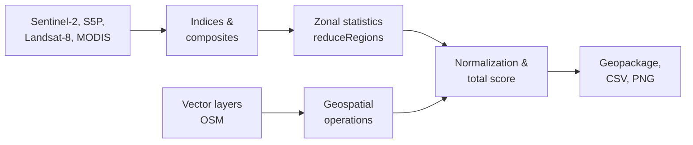

# __Remote sensing-based environmental assessment of urban districts__


[RU Русская версия](README.ru.md)

### A Python-based pipeline automating GIS workflows for urban ecology. Integrates multi-source satellite data and OSM layers to calculate spectral indices, perform zonal statistics, and produce normalized environmental scores. Developed as a practical implementation of my Bachelor's thesis methodology in Environmental Science.

### Key tools: 
- __Google Earth Engine__
- __GeoPandas__
- __Geemap__ 
- __Shapely__
- __Matplotlib__


## Methodology
### The total environmental score is calculated as the arithmetic mean of five selected factors (criteria):
- `vegetation_density` - green saturation of each region (Sentinel-2)
- `air_pollution` - air pollution subindex based on the average of five air components: NO2, SO2, CO, O3 (Sentinel-5P)
- `lst` - land surface temperature (combined from LANDSAT-8 and MODIS)
- `built_up_area` - built-up area per district including impervious surfaces
- `road_density` - total length (km) of roads per district


## Workflow


## Results

#### Example of ranking maps:
| SAO | NEAO |
|:---:|:---:|
|  |  |


#### Example Output

| District | Vegetation | Built-up | LST (°C) | Air | Road density | Total score |
|----------|------------|----------|----------|-----|--------------|-------------|
| Донской  | 0.21 | 0.47 | 31.3 | 0.55 | 0.42 | 0.51 |
| Даниловский | 0.13 | 0.62 | 31.6 | 0.48 | 0.40 | 0.45 |
| ... | ... | ... | ... | ... | ... | ... |

## How to run
### 1. Install dependencies:

```bash
pip install -r requirements.txt
```

### 2. Prepare data

__Vectors__

| Data   | Format | Description | Tag example |
| ------ | ------ | ----------- | ------------ |
| districts | .gpkg  | Administrative units at the city or county scale | `admin_level=8`, `admin_level=9` |
| roads | .gpkg | Linear highway objects | `highway=motorway`, `highway=primary`, `highway=secondary`,.. |

Put the obtained data into the `data/` folder
</br>

_You can obtain these layers from OpenStreetMap using QGIS (OSM plugin) or via the OSMnx library._

__Rasters__

Rasters are exported once to GEE Assets via the [preprocessing.py](preprocessing.py)
```bash
python preprocessing.py --region example_region
```

### 3. Configure the .env file

 - Copy and rename [.env.example](.env.example) file to .env

```bash
cp .env.example .env
```

- Enter your credentials and assets' directories

```env
PROJECT_ID=your-cloud-project-ID
LOC_DISTR=data/districts.gpkg
LOC_ROADS=data/roads.gpkg
```

### 4. Run pipeline
```bash
python main.py
```

## Notes
- The assessment is comparative, not absolute. Designed for ranking districts within a city and doesn't respond to environmental standards.
- Accuracy depends on satellite data quality and vector layer completeness.
- Currently optimized for urban districts.
- Subjective assessment methodology.