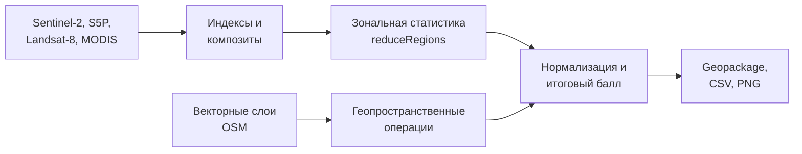
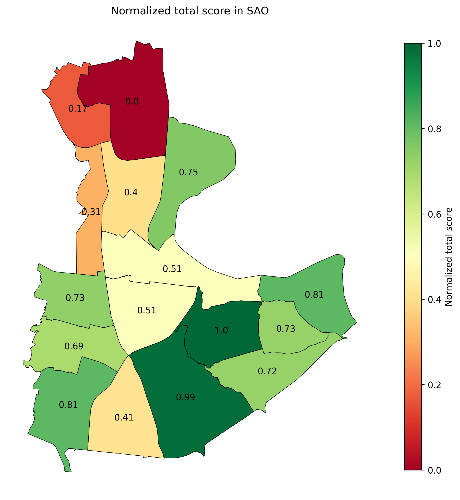
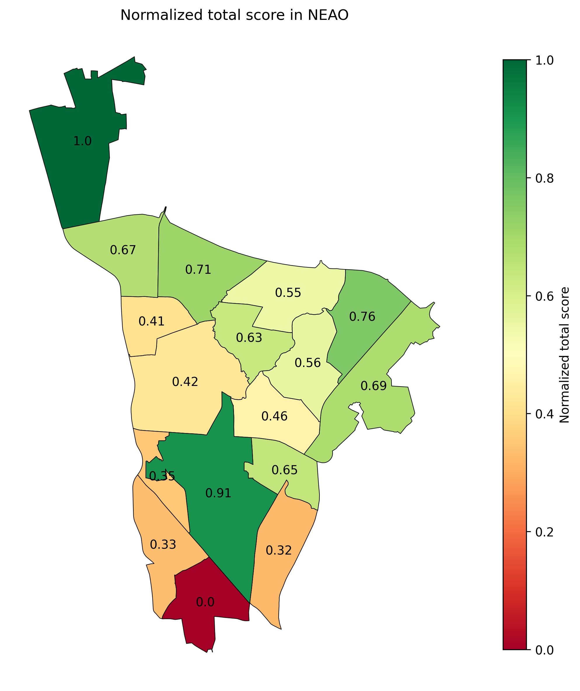

# __Оценка состояния окружающей среды городских районов на основе ДЗЗ__


[EN English version](README.md)

### Конвейер обработки данных, автоматизирующий рабочие процессы ГИС в сфере городской экологии. Система объединяет спутниковые данные из различных источников и слои OSM для расчета спектральных индексов, выполнения зональной статистики и формирования нормализованных показателей состояния окружающей среды. Основано на методологии дипломной работы.

#### Основные инструменты:
- __Google Earth Engine__
- __GeoPandas__
- __Geemap__ 
- __Shapely__
- __Matplotlib__


## Методология
### Итоговый экологический балл рассчитывается как среднее арифметическое пяти выбранных критериев:
- `vegetation_density` — насыщенность растительностью каждого района (Sentinel-2)
- `air_pollution` — субиндекс загрязнения воздуха на основе среднего по пяти компонентам: NO2, SO2, CO, O3 (Sentinel-5P)
- `lst` — температура земной поверхности (комбинация LANDSAT-8 и MODIS)
- `built_up_area` — площадь застройки на район, включая водонепроницаемые поверхности
- `road_density` — суммарная длина дорог (км) на район


## Схема работы


## Результаты

#### Примеры карт ранжирования:
| ЮАО | СВАО |
|:---:|:---:|
|  |  |


#### Пример выходных данных

| Район | Растительность | Застройка | LST (°C) | Воздух | Плотность дорог | Итоговый балл |
|----------|------------|----------|----------|-----|--------------|-------------|
| Донской  | 0.21 | 0.47 | 31.3 | 0.55 | 0.42 | 0.51 |
| Даниловский | 0.13 | 0.62 | 31.6 | 0.48 | 0.40 | 0.45 |
| ... | ... | ... | ... | ... | ... | ... |


## Как запустить
### 1. Установка зависимостей:

```bash
pip install -r requirements.txt
```

### 2. Подготовка данных

__Vectors__

| Данные   | Формат | Описание | Примеры тегов |
| ------ | ------ | ----------- | ------------ |
| districts | .gpkg  | Административные единицы городского или районного масштаба | `admin_level=8`, `admin_level=9` |
| roads | .gpkg | Линейные объекты дорожной сети | `highway=motorway`, `highway=primary`, `highway=secondary`,.. |

Поместите полученные данные в папку `data/`
</br>

_Вы можете получить эти слои из OpenStreetMap с помощью QGIS (плагин OSM) или библиотеки OSMnx._

__Растровые данные__

Растры экспортируются через [preprocess.py](preprocess.py)
```bash
python preprocessing.py --region example_region
```

### 3. Настройка .env файла

 - Копируйте [.env.example](.env.example) файл в .env

```bash
cp .env.example .env
```

- Введите свои учетные данные и пути к локальным входным данным

```env
PROJECT_ID=your-cloud-project-ID
LOC_DISTR=data/districts.gpkg
LOC_ROADS=data/roads.gpkg
```

### 4. Запуск пайплайна
```bash
python main.py
```

## Примечания
- Оценка является сравнительной, а не абсолютной. Предназначена для ранжирования районов внутри города и не соотносится с экологическими нормативами.
- Точность зависит от качества спутниковых данных и полноты векторных слоёв.
- В настоящее время оптимизировано для городских районов.
- Методология оценки субъективна.